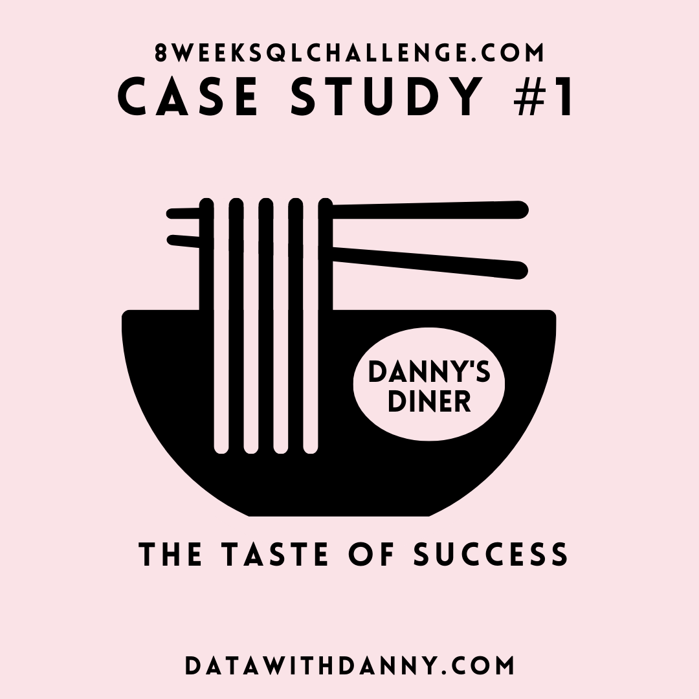
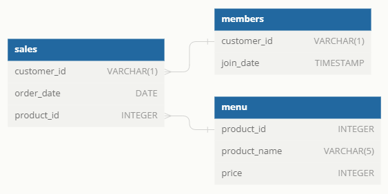
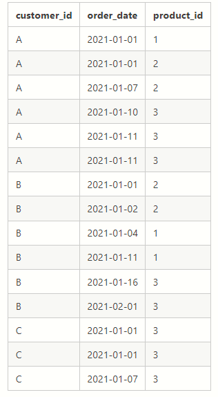
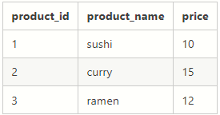
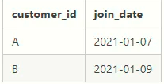

# SQL ANALYSIS-ANALYZING CUSTOMER BEHAVIORAL IN A JAPANESE RESTUARANT(DANNY'S DINNER)

**_8-Week SQL Challenge, Case Study #1 by Danny Ma_**

This case study centers on analyzing data to give meaningful insights on customer behavior and overall business performance in Danny’s Dinner

## INTRODUCTION

Danny seriously loves Japanese food so in the beginning of 2021, he decides to embark upon a risky venture and opens up a cute little restaurant that sells his 3 favorite foods: sushi, curry and ramen.
Danny’s Diner is in need of your assistance to help the restaurant stay afloat — the restaurant has captured some very basic data from their few months of operation but have no idea how to use their data to help them run the business.

## ABOUT THE DATASET

Danny has shared with you 3 key datasets for this case study:

1. sales
2. menu
3. members

All datasets exist within the dannys_diner database schema - 

## DATA MODELLING

## CREATING TABLES
[View my code](Create.sql)

## TABLE 1: SALES 

The sales table captures all customer_id level purchases with an corresponding order_date and product_id information for when and what menu items were ordered.

## TABLE 2: MENU

The menu table maps the product_id to the actual product_name and price of each menu item.

## TABLE 3: MEMBERS

The final members table captures the join_date when a customer_id joined the beta version of the Danny’s Diner loyalty program.

## PROBLEM STATEMENTS

1.What is the total amount each customer spent at the restaurant?

2. How many days has each customer visited the restaurant?

3. What was the first item from the menu purchased by each customer?

4. What is the most purchased item on the menu and how many times was it purchased by all customers?

5. Which item was the most popular for each customer?

6. Which item was purchased first by the customer after they became a member?

7. Which item was purchased just before the customer became a member?

8. What is the total items and amount spent for each member before they became a member?

9. If each $1 spent equates to 10 points and sushi has a 2x points multiplier — how many points would each customer have?

10. In the first week after a customer joins the program (including their join date) they earn 2x points on all items, not just sushi — how many points do customer A and B have at the end of January?

## SKILLS/CONCEPTS DEMONSTRATED

1. JOINS
2. CTEs functions
3. Subqueries
4. Aggregations

## EXPLORATORY DATA ANALYSIS
[View my code](EDA.sql)

## FINDINGS/INSIGHTS.

1. Ramen is the most purchased item while Sushi is the least purchased item.
2. Customer C does not have a membership card, unlike Customer A and Customer B. Customer C also has a few visiting days at the restaurant which might be as a result of the Customer having only one preference for a product. Ramen is the only product Customer C purchased.

## RECOMMENDATIONS.

1. Ramen seems to be Customer C’s favorite item, however, customer survey data should be collected and data-driven questions should be made to understand why customer C patronized just once. Other factors like Customer services could be related.
2. Before becoming a member , Ramen was purchased by the customers , after obtaining the membership card, each customers purchased a different product. The customer survey data should be further analyzed to help provide more insights into the customer experience.
3. To increase the purchase of the least popular item like Sushi, strategic marketing campaigns. Discounts, or adjusting the menu can be used in attracting customers to try these products which will help boost their popularity and purchase.

## CONCLUSION.
The case study helped in uncovering insights about the customers behavior and these insights would assist in further analysis regarding customer satisfaction with the products and customer service to improve Danny’s business growth.

## Thank you for following through.
